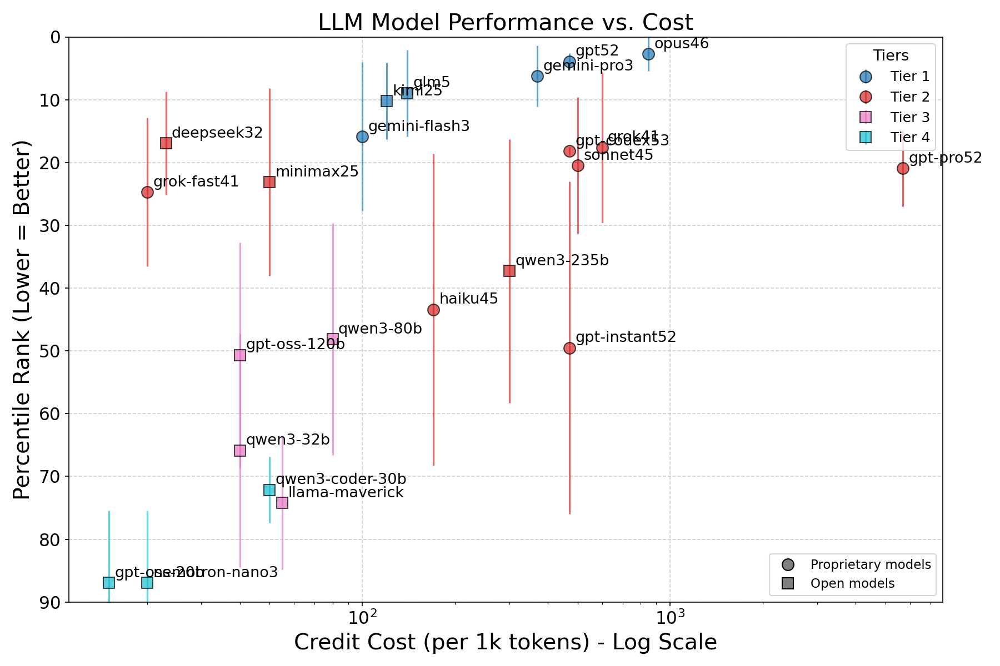
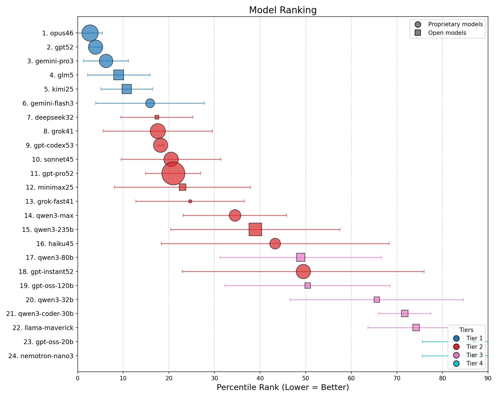

# LLM Benchmark Aggregator

A command-line tool that computes a unified model ranking from multiple benchmark leaderboards using **percentile-normalized** scores. It ingests a simple data file of per-benchmark ranks, normalizes them to a common 0–1 scale, and outputs a single sorted table so you can compare models at a glance.

Visualize model performance with statistical tiering: Generate scatter plots showing performance vs. cost, with models color-coded by statistical performance tiers based on the "Indistinguishable from Best" method.

## Quick start

```shell
# evaluate across general reasoning leaderboards 
python rank_models.py data/ranks_general.txt  
```

The above command will produce the following output:

```text
+------------------------------------------------------------------------------------+
| Rank  | Model                   | Avg Pctl  | Std Dev   | # Benchmarks  | Cost/1k  |
+------------------------------------------------------------------------------------+
| 1     | opus                    | 0.030     | 0.021     | 7             | 850      |
| 2     | gemini                  | 0.076     | 0.050     | 7             | 370      |
| 3     | gpt                     | 0.077     | 0.047     | 7             | 470      |
| 4     | gpt-codex               | 0.095     | 0.071     | 6             | 470      |
| 5     | gpt-pro                 | 0.103     | 0.107     | 3             | 5600     |
| 6     | sonnet                  | 0.170     | 0.137     | 7             | 500      |
| 7     | kimi                    | 0.205     | 0.130     | 7             | 120      |
| 8     | glm                     | 0.226     | 0.222     | 7             | 94       |
| 9     | gemini-flash            | 0.237     | 0.233     | 7             | 100      |
| 10    | haiku                   | 0.241     | 0.205     | 5             | 170      |
...
```

For the plots:

```shell
# generate performance plot for general reasoning
python rank_models.py data/ranks_general.txt --plot

# generate scatter plot with quadrant overlays
python rank_models.py data/ranks_general.txt --plot --quadrants
```

This will output two plots. The first is the average ranking as a function of API cost:
  
**Figure 1: General intelligence vs model cost.** Y-axis indicates the average percentile rank on a scale from 1 (best) to 100 (worst). X-axis is the log10 of the model’s credit cost per 1k tokens (relative). Colors indicate the model tier. Error bars ($1 \sigma$) indicate the variation of a model ranking across different benchmarks.

The second plot is a different visualization of the tiers: 
  
**Figure 2: Model ranking (general intelligence).** Bigger circles indicate more expensive models.

The same plots but evaluating coding and agentic coding performance are available in the `data` folder (files `ranks_coding.png` and `ranks_coding_ranking.png`).

For more detailed information about the ranking procedure and for debugging:

```
# show detailed tiering diagnostics
python rank_models.py ranks_general.txt --debug

# combine debug and plot
python rank_models.py ranks_general.txt -d -p
```


### Requirements

**Core functionality:** Python 3.10+ (standard library only)

**Plotting feature (optional):** pandas, matplotlib, numpy
```bash
pip install pandas matplotlib numpy  # only needed for --plot flag
```

### Command-line Arguments

```
python rank_models.py [filename] [-p|--plot] [-d|--debug] [-q|--quadrants]
```

| Argument | Description |
|----------|-------------|
| `filename` | Path to the input file containing benchmark data. Defaults to `ranks_general.txt` if not provided. |
| `-p`, `--plot` | Generate a PNG scatter plot of model performance vs. cost with statistical tiering visualization. |
| `-d`, `--debug` | Show detailed tiering diagnostics including leader selection, overlap checks, and tier assignments. |
| `-q`, `--quadrants` | Overlay quadrant dividers and labels on the scatter plot. Divides the chart into four regions — **Best value** (low cost, high perf), **Premium** (high cost, high perf), **Budget** (low cost, low perf), **Avoid** (high cost, low perf) — using the geometric mean of cost and median score as midpoints. Requires `--plot`. |

## Input format for datafile

The file contains one or more **benchmark dictionaries** followed by exactly one **cost dictionary** as the last entry. Each dictionary is a standard Python `dict` literal and may span multiple lines.

### Benchmark dictionaries

Each benchmark is written as `name={...}` (the name is purely cosmetic and not used in output). Every dictionary must include a `known_totals` key indicating how many models were evaluated on that leaderboard. All other keys are model identifiers mapped to either an integer rank or `None` (not evaluated).

```python
LiveBench={"sonnet":12, "opus":1, "haiku":41,
"gpt":3, "gemini":6,
"known_totals":52}
```

The included files contain leaderboards which are current as of Feb. 11 2026 manually pulled from the following websites:

https://livebench.ai/#/  
https://scale.com/leaderboard/  
https://arena.ai/leaderboard/  
https://www.tbench.ai/leaderboard/terminal-bench/2.0  
https://artificialanalysis.ai  
https://gorilla.cs.berkeley.edu/leaderboard.html#leaderboard  
https://www.swebench.com

### Cost dictionary

The last dictionary in the file holds credit costs per 1 000 tokens. It has no `known_totals` key and needs no variable-name prefix. Models missing from this dictionary will show `N/A` in the output. The value here is arbitrary. In the sample data included, it corresponds to Poe API credits.

```python
# Credit cost per 1k tokens
{"sonnet":500, "opus":850, "haiku":170, "gpt":470, "gemini":370}
```


## Methodology

### 1. Percentile normalization

For every model with a non-`None` rank in a given benchmark:

```
percentile = rank / known_totals
```

**Why percentile normalization?**  
Raw ranks from different benchmarks are not directly comparable. A rank of 10 on a 300-model leaderboard is far more impressive than a rank of 10 on a 30-model leaderboard. Dividing each rank by the total number of evaluated models (`known_totals`) maps every score onto a 0–1 fractional percentile (0 = best, 1 = worst), making cross-benchmark comparison meaningful.

### 2. Averaging

A model's base score is the arithmetic mean of its percentile values across all benchmarks it appears in. Every benchmark carries equal weight.

### 3. Sparse-data penalty

Models evaluated on very few benchmarks get a penalty added to their average to avoid over-rewarding thin evidence:

| Benchmarks appeared in | Penalty |
|------------------------|---------|
| 1                      | +0.25   |
| 2                      | +0.10   |
| 3 or more              | +0.00   |

**Note:** Penalized scores are capped at 1.0 (100th percentile) to prevent exceeding the theoretical maximum.

### 4. Standard deviation

Population standard deviation is computed over the pre-penalty percentile scores. Models with fewer than 2 data points report `N/A`.

### 5. Missing data

`None` values and absent keys are treated as "not evaluated" — the benchmark is simply excluded from that model's calculations.

### 6. Name matching

Model keys are compared as exact strings. No fuzzy matching or alias merging is performed (e.g. `qwen3-235` and `qwen3-80` remain separate models).


## Output

### ASCII Table

A sorted ASCII table (best model first):

```
+-----------------------------------------------------------------------------+
| Rank  | Model                  | Avg Pctl | Std Dev  | # Benchmarks | Cost/1k |
+-----------------------------------------------------------------------------+
| 1     | opus                   | 0.019    | 0.009    | 4            | 850     |
| 2     | gemini                 | 0.048    | 0.046    | 4            | 370     |
| ...   | ...                    | ...      | ...      | ...          | ...     |
+-----------------------------------------------------------------------------+
```

| Column         | Description                                              |
|----------------|----------------------------------------------------------|
| **Rank**       | Position in the final aggregated ranking (1 = best).     |
| **Model**      | Model identifier string (exactly as written in the file).|
| **Avg Pctl**   | Mean percentile after sparse-data penalty, 0–1 scale.    |
| **Std Dev**    | Population std dev of percentile scores, or `N/A`.       |
| **# Benchmarks** | Number of benchmarks the model was evaluated on.      |
| **Cost/1k**    | Credit cost per 1 000 tokens, or `N/A` if unavailable.   |

### Visualization Plot (`--plot`)

When using the `--plot` flag, the tool generates a PNG image with the same basename as your input file (e.g., `ranks_general.txt` → `ranks_general.png`).

**Quadrant overlay (`--quadrants`, `-q`):** Pass this flag together with `--plot` to divide the scatter plot into four labelled, shaded regions. The vertical divider is placed at the geometric mean of all plotted model costs (log-scale midpoint); the horizontal divider sits at the median aggregate score. This makes it easy to spot which models offer the best performance per dollar.

#### Statistical Tiering Methodology

Models are grouped into performance tiers using a statistically rigorous approach:

1. **Tier 1**: Contains the best-performing model (leader) plus any models whose performance is statistically indistinguishable from the leader (68% confidence interval overlap)
2. **Tier 2**: After removing Tier 1 models, the next-best performer becomes the new leader; models overlapping with this leader form Tier 2
3. **Repeat**: Continue until all models are categorized

**Mathematical criterion**: A model belongs to the current tier if:
```
(model_score - 1σ) ≤ (leader_score + 1σ)
```

This means if a model's best-case performance (score minus one standard deviation) could reach the leader's worst-case performance (score plus one standard deviation), they are statistically tied.

## Extending the data

To add a new benchmark, append a new dictionary above the cost dictionary in your data file:

```python
new_bench={"opus":2, "sonnet":5, "gpt":1, "known_totals":40}
```

To add a new model, insert its key and rank into each relevant benchmark dictionary and, optionally, add its cost to the cost dictionary.


## Why "Indistinguishable from Best" Tiering?

Traditional rankings treat every rank position as meaningfully different. However, in statistical analysis, two models with overlapping confidence intervals cannot be confidently ranked against each other. The "Indistinguishable from Best" method, common in scientific literature, acknowledges this uncertainty by grouping statistically tied performers.

This approach answers the practical question: "Which models can I confidently say are among the best?" rather than forcing artificial distinctions where uncertainty exists.
