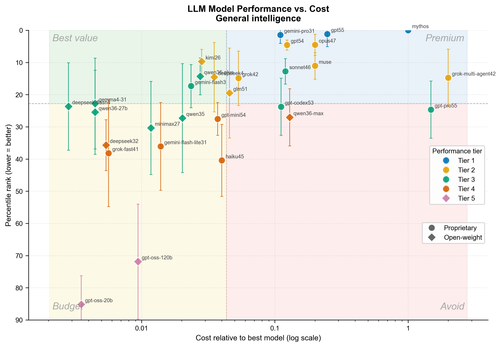
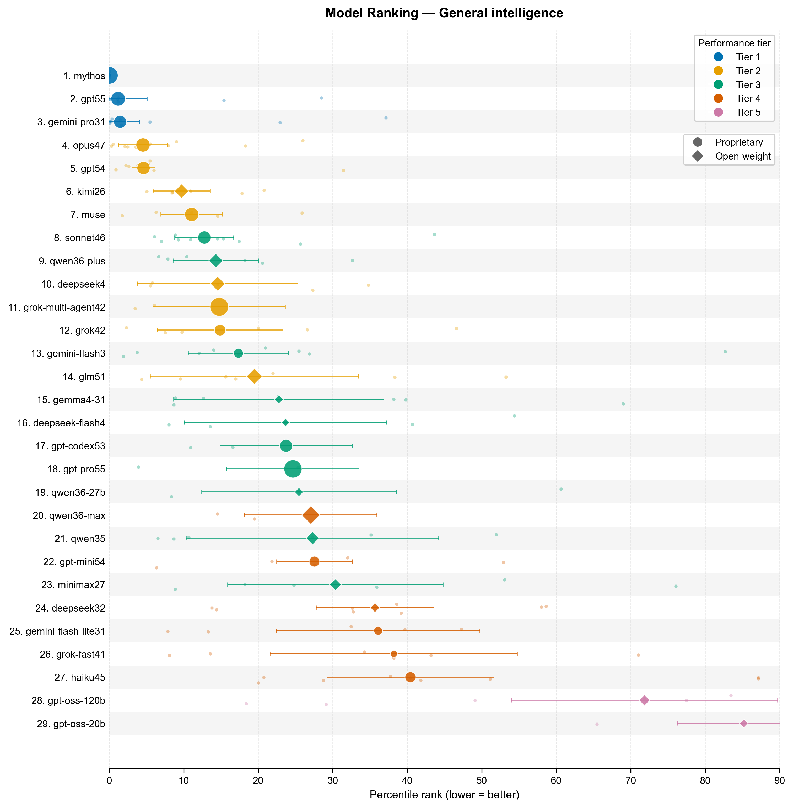

# LLM Benchmark Aggregator

A command-line tool that computes a unified model ranking from multiple benchmark leaderboards using **percentile-normalized** scores. It ingests a simple data file of per-benchmark ranks, normalizes them to a common 0–1 scale, and outputs a single sorted table so you can compare models at a glance.

Visualize model performance with robust tiering: Generate scatter plots showing performance vs. cost, with models color-coded by performance tiers based on the "Indistinguishable from Best" overlap rule.

## Quick start

```shell
# evaluate across general reasoning leaderboards 
python rank_models.py general  
```

Valid categories: `general`, `coding`, `agentic`, `stem`.

The above command will produce the following output:

```text
+-------------------------------------------------------------------------------------+
| Rank  | Model                   | Avg Pctl  | -err  | +err  | # Benchmarks  | Rel. Cost |
+-------------------------------------------------------------------------------------+
| 1     | opus                    | 0.030     | 0.018     | 7             | 1.000     |
| 2     | gemini                  | 0.076     | 0.044     | 7             | 0.435     |
| 3     | gpt                     | 0.077     | 0.041     | 7             | 0.553     |
| 4     | gpt-codex               | 0.095     | 0.063     | 6             | 0.553     |
| 5     | gpt-pro                 | 0.103     | 0.091     | 3             | 6.588     |
| 6     | sonnet                  | 0.170     | 0.121     | 7             | 0.588     |
| 7     | kimi                    | 0.205     | 0.115     | 7             | 0.141     |
| 8     | glm                     | 0.226     | 0.198     | 7             | 0.111     |
| 9     | gemini-flash            | 0.237     | 0.209     | 7             | 0.118     |
| 10    | haiku                   | 0.241     | 0.183     | 5             | 0.200     |
...
```

For the plots:

```shell
# generate performance plot for general reasoning
python rank_models.py general --plot

# generate scatter plot with quadrant overlays
python rank_models.py general --plot --quadrants
```

Plots are written to `figures/General intelligence.png` and `figures/General intelligence_ranking.png` (the `figures/` directory is created automatically).

This will output two plots. The first is the average ranking as a function of API cost:
  
**Figure 1: General intelligence vs model cost.** Y-axis indicates the median percentile rank on a scale from 1 (best) to 100 (worst). X-axis is the cost relative to the best-ranked model (log scale; best model = 1). Colors indicate the model tier. Error bars span Q1 to Q3 around the median (asymmetric), indicating the variation of a model ranking across different benchmarks. Circles = proprietary models; diamonds = open-weight models.

The second plot is a different visualization of the tiers: 
  
**Figure 2: Model ranking (general intelligence).** Bigger circles indicate more expensive models. Small semi-transparent dots show the individual per-benchmark percentile values, revealing the spread, skewness, and outliers behind each aggregate score.

To regenerate plots for all four categories in one shot:

```shell
make refresh-plots
```

`make refresh-plots` loops over `general`, `coding`, `agentic`, and `stem`, calling `rank_models.py --plot --quadrants <category>` for each and writing all PNGs into `figures/`.

If you want to mirror those PNGs into another directory, set `WEBSITE_PLOTS_DIR`:

```shell
make refresh-plots WEBSITE_PLOTS_DIR=/path/to/site/assets
```

For more detailed information about the ranking procedure and for debugging:

```
# show detailed tiering diagnostics
python rank_models.py general --debug

# combine debug and plot
python rank_models.py general -d -p
```


### Requirements

**Core functionality:** Python 3.10+ (standard library only)

**Plotting feature (optional):** pandas, matplotlib, numpy
```bash
pip install pandas matplotlib numpy  # only needed for --plot flag
```

### Command-line Arguments

```
python rank_models.py [category] [-p|--plot] [-d|--debug] [-q|--quadrants]
```

| Argument | Description |
|----------|-------------|
| `category` | Ranking category to compute. One of `general`, `coding`, `agentic`, `stem`. Defaults to `coding` if not provided. |
| `-p`, `--plot` | Generate PNG scatter plots of model performance vs. cost with tiering visualization. Written to `figures/<Category title>.png` and `figures/<Category title>_ranking.png`. |
| `-d`, `--debug` | Show detailed tiering diagnostics including leader selection, overlap checks, and tier assignments. |
| `-q`, `--quadrants` | Overlay quadrant dividers and labels on the scatter plot. Divides the chart into four regions — **Best value** (low cost, high perf), **Premium** (high cost, high perf), **Budget** (low cost, low perf), **Avoid** (high cost, low perf) — using the geometric mean of cost and median score as midpoints. Requires `--plot`. |

### Automation shortcuts

```bash
make refresh-plots
make refresh-ranking-data
make test
make validate
```

- `make refresh-plots` regenerates all plot PNGs for the four categories.
- `make refresh-ranking-data` rewrites website JSON under `docs/data/`.
- `make test` runs `pytest tests/ -v`.
- `make validate` runs `ruff`, `mypy --strict`, `make test`, and a temporary-directory JSON export smoke test.

## Input format for data files

Active model data lives in two centralized TOML files under `data/`, parsed with Python's
standard-library `tomllib`. `data/retired.toml` is a historical archive and is not loaded
into rankings or website exports.

### `data/benchmarks.toml`

One TOML table per benchmark. Each benchmark has:

- `categories`: **required** list of one or more category tags (`"general"`, `"coding"`, `"agentic"`, `"stem"`).
- Either `min_score` (score-based) or `known_totals` (rank-based).
- A nested `[benchmark_name.scores]` table mapping model name to score or rank.

**Score-based** — model scores are numeric, higher = better. `min_score` sets the floor for percentile normalization.

```toml
[artificial_analysis_agentic]
categories = ["coding", "agentic"]
min_score = 5

[artificial_analysis_agentic.scores]
gemini-flash3 = 50
gpt56sol = 74
opus5 = 70
sonnet5 = 63
```

**Rank-based** — models are mapped to integer ranks (lower = better). `known_totals` is the total number of models evaluated on that leaderboard.

```toml
[livebench_coding]
categories = ["coding"]
known_totals = 347

[livebench_coding.scores]
deepseek4 = 34
gemini-flash3 = 19
# Omit models that were not evaluated on this benchmark.
```

The included benchmarks are manually refreshed periodically; see commit history for the last update. Sources include:

https://livebench.ai/#/  
https://scale.com/leaderboard/  
https://arena.ai/leaderboard/  
https://www.tbench.ai/leaderboard/terminal-bench/2.0  
https://artificialanalysis.ai  
https://gorilla.cs.berkeley.edu/leaderboard.html#leaderboard  
https://www.swebench.com

### `data/models.toml`

One TOML table per model, alphabetical by model name. Each entry holds USD cost and model type:

```toml
[deepseek4]
cost = 5.1
open = true

[gemini-pro31]
cost = 16.0
open = false
```

| Field | Description |
|-------|-------------|
| `cost` | USD per 1M tokens (input + output combined). Missing pricing shows `N/A` in Rel. Cost column. |
| `open` | `true` = open-weight model (drawn as a **diamond** in scatter plots). `false` = proprietary (drawn as a **circle**). |

Models absent from `models.toml` show `N/A` in the Rel. Cost column.


## Methodology

### 1. Percentile normalization

**Rank-based benchmarks:**

```
percentile = rank / known_totals
```

**Score-based benchmarks:**

```
percentile = (max_score - score) / (max_score - min_score)
```

In both cases, 0.0 = best and 1.0 = worst.

**Why percentile normalization?**  
Raw ranks from different benchmarks are not directly comparable. A rank of 10 on a 300-model leaderboard is far more impressive than a rank of 10 on a 30-model leaderboard. Dividing each rank by the total number of evaluated models (`known_totals`) maps every score onto a 0–1 fractional percentile (0 = best, 1 = worst), making cross-benchmark comparison meaningful.

### 2. Median aggregation

A model's base score is the median of its percentile values across all benchmarks it appears in. Every benchmark carries equal weight. The median is used instead of the mean for robustness against outlier benchmarks where a model performs unusually well or poorly.

### 3. Sparse-data penalty

Models evaluated on very few benchmarks get a penalty added to their average to avoid over-rewarding thin evidence:

| Benchmarks appeared in | Penalty |
|------------------------|---------|
| 1                      | +0.25   |
| 2                      | +0.10   |
| 3 or more              | +0.00   |

**Note:** Penalized scores are capped at 1.0 (100th percentile) to prevent exceeding the theoretical maximum.

### 4. Asymmetric IQR bounds (dispersion)

The lower (`median − Q1`) and upper (`Q3 − median`) distances from the median to the first and third quartiles are kept separate, reflecting the true skew of each model's benchmark distribution. They serve as the asymmetric error bars in plots and as the overlap interval in tier classification. Models with fewer than 3 data points report `N/A` (IQR is degenerate for n < 3); these use the average lower/upper across all other models as a stand-in for tiering purposes.

### 5. Missing data

`None` values and absent keys are treated as "not evaluated" — the benchmark is simply excluded from that model's calculations.

### 6. Name matching

Model keys are compared as exact strings. No fuzzy matching or alias merging is performed (e.g. `qwen3-235` and `qwen3-80` remain separate models).


## Output

### ASCII Table

A sorted ASCII table (best model first):

```
+------------------------------------------------------------------------------+
| Rank  | Model                  | Avg Pctl | -err  | +err  | # Benchmarks | Rel. Cost |
+------------------------------------------------------------------------------+
| 1     | opus                   | 0.019    | 0.008    | 4            | 1.000     |
| 2     | gemini                 | 0.048    | 0.041    | 4            | 0.435     |
| ...   | ...                    | ...      | ...      | ...          | ...       |
+------------------------------------------------------------------------------+
```

| Column           | Description                                                                 |
|------------------|-----------------------------------------------------------------------------|
| **Rank**         | Position in the final aggregated ranking (1 = best).                        |
| **Model**        | Model identifier string (exactly as written in the file).                   |
| **Avg Pctl**     | Median percentile after sparse-data penalty, 0–1 scale.                     |
| **-err / +err**  | Lower (`median − Q1`) and upper (`Q3 − median`) IQR distances, or `N/A`.    |
| **# Benchmarks** | Number of benchmarks the model was evaluated on.                            |
| **Rel. Cost**    | Cost relative to the best-ranked model (best = 1.000), or `N/A` if unavailable. |

### Visualization Plot (`--plot`)

When using the `--plot` flag, the tool generates two PNG images in a `figures/` subdirectory (auto-created next to `rank_models.py`):

- `figures/<Category title>.png` — scatter plot of performance vs. cost
- `figures/<Category title>_ranking.png` — horizontal ranking chart

e.g. `python rank_models.py general --plot` writes `figures/General intelligence.png` and `figures/General intelligence_ranking.png`.

Open-weight models are drawn as **diamonds**; proprietary models are drawn as **circles**.

**Quadrant overlay (`--quadrants`, `-q`):** Pass this flag together with `--plot` to divide the scatter plot into four labelled, shaded regions. The vertical divider is placed at the geometric mean of all plotted model costs (log-scale midpoint); the horizontal divider sits at the median aggregate score. This makes it easy to spot which models offer the best performance per dollar.

#### Tiering Methodology

Models are grouped into performance tiers using a robust descriptive overlap rule:

1. **Tier 1**: Contains the best-performing model (leader) plus any models whose asymmetric Q1–Q3 interval overlaps with the leader's interval
2. **Tier 2**: After removing Tier 1 models, the next-best performer becomes the new leader; models overlapping with this leader form Tier 2
3. **Repeat**: Continue until all models are categorized

**Mathematical criterion**: A model belongs to the current tier if:
```
(model_score - lower_err) ≤ (leader_score + upper_err)
```
where `lower_err = median − Q1` and `upper_err = Q3 − median`.

This means if a model's best-case performance (score minus its lower IQR distance) could reach the leader's worst-case performance (score plus its upper IQR distance), the two are placed in the same tier. Asymmetric IQR bounds are used as the dispersion measure because they are the natural robust companion to the median aggregate, make no distributional assumptions, and correctly reflect the skew of each model's benchmark distribution. This is a descriptive grouping rule, not a formal hypothesis test.

## Extending the data

To add a new benchmark, append a new TOML table to `data/benchmarks.toml`:

```toml
[new_bench]
categories = ["general"]
known_totals = 40

[new_bench.scores]
gpt56sol = 1
opus5 = 2
sonnet5 = 5
```

Use `min_score` instead of `known_totals` for score-based benchmarks. Omit models that were not evaluated.

To add a new model, insert its key into `data/models.toml` and into each relevant benchmark's scores table:

```toml
[new-model]
cost = 300
open = false
```


## Why "Indistinguishable from Best" Tiering?

Traditional rankings treat every rank position as meaningfully different. This tool instead uses the "Indistinguishable from Best" overlap rule to group models whose robust spread intervals are too close to support a sharp separation.

This approach answers the practical question: "Which models belong in the current top cluster?" rather than forcing a strict total order out of sparse, noisy benchmark data.
